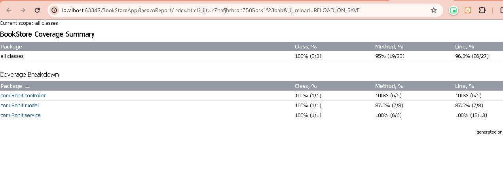
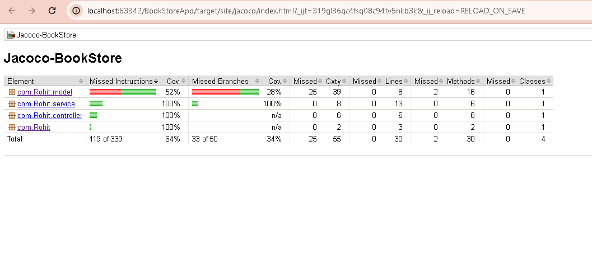

# BookstoreAPI 📚✨

Welcome to the BookstoreAPI project, a simple REST API built with the powerful Apache Camel framework to manage a collection of books. 🚀

[](https://scrutinizer-ci.com/g/owncloud/music/)


## Table of Contents 𝄜

- [Project Overview](#project-overview)
- [Requirements](#requirements)
- [Getting Started](#getting-started)
- [API Endpoints](#api-endpoints)
- [Data Model](#data-model)
- [Database](#database)
- [Unit Tests](#unit-tests)
- [Contributing](#contributing)
- [License](#license)

## Project Overview 🚀

We are working on a project that requires building a REST API using Apache Camel to manage a collection of books. This README.md file provides essential information to understand and contribute to the BookstoreAPI project.

## Requirements 🛠️

To successfully run and contribute to this project, make sure to fulfill the following requirements:

1. Create a Maven project named "BookstoreAPI" using the Camel Maven archetype.
2. Implement a REST API with the specified endpoints.
3. Define a `Book` class with the specified properties.
4. Use Camel's REST DSL to define the REST API routes.
5. Implement a simple in-memory database (H2 database) or choose a data store (MySQL, PostgreSQL).
6. Write unit tests for the API routes using Camel's CamelTestSupport and JUnit, including a database mock.

## Project Structure ⛓️

```

.
├── src
│ ├── main
│ │ ├── java
│ │ │ └── com
│ │ │ └── example
│ │ │ └── bookstore
│ │ │ ├── BookstoreApiApplication.java
│ │ │ ├── model
│ │ │ │ └── Book.java
│ │ │ ├── route
│ │ │ │ └── BookRoutes.java
│ │ │ └── service
│ │ │ └── BookService.java
│ │ └── resources
│ │ ├── application.properties
│ │ 
│ └── test
│ └── java
│ └── com
│ └── example
│ └── bookstore
│ ├── BookstoreApiApplicationTest.java
│ └── routes
│ └── BookRoutesTest.java
├── .gitignore
├── pom.xml
├── README.md
└── .mvn
├── maven-wrapper.jar
└── maven-wrapper.properties
```
### Technologies Used 🛠️

1. **Springboot:** Spring Boot is an open-source, microservice-based Java web framework offered by Spring, particularly useful for software engineers developing web apps and microservices.

2. **Maven:** Maven is a project management and build automation tool that helps developers build, publish, and deploy projects.

3. **Apache Camel:** Apache Camel ™ is a versatile open-source integration framework based on known Enterprise Integration Patterns. Camel empowers you to define routing and mediation rules in a variety of domain-specific languages (DSL, such as Java, XML, Groovy, Kotlin, and YAML).

4. **Swagger:** Swagger is a set of tools for API developers that helps with design, documentation, and testing. It's also a former specification that the OpenAPI Specification is based on requirements.

## Getting Started ✅

To get started with the BookstoreAPI project, follow these steps:

1. Clone the repository: `git clone <repository-url>`
2. Navigate to the project directory: `cd BookstoreAPI`
3. Build the project using Maven: `mvn clean install`
4. Run the application: `mvn camel:run`

## API Endpoints 👨‍💻

The API provides the following endpoints:
``Swagger Editor Endpoints``

- `GET camel/books/all`: Retrieves a list of all books.
- `GET camel/books/{id}`: Retrieves details of a specific book.
- `POST camel/books`: Adds a new book.
- `PUT camel/books/{id}`: Updates an existing book.
- `DELETE camel/books/{id}`: Deletes a book.


- `Note`: Copy openapi.txt file text and paste it on Swagger editor = https://editor.swagger.io/ after pasting it Camel Routes api Documentation wil be ready 
`And` If it Gives 404 error while hitting an endpoint just pls try to hit using `Postman` or `Swagger Ui` Documentation that is `http://localhost:8081/swagger-ui/index.html#/book-controller/getBook`.

#### Swagger 🍀

``Swagger Ui Endpoints``

- `GET /books`: Retrieves a list of all books.
- `GET /books/{id}`: Retrieves details of a specific book.
- `POST /books`: Adds a new book.
- `PUT /books/{id}`: Updates an existing book.
- `DELETE /books/{id}`: Deletes a book.


- `Swagger Ip Address`: http://localhost:8081/swagger-ui/index.html#/book-controller/getBook.


For detailed information on how to use each endpoint, refer to the API documentation.

## Data Model

The `Book` class represents the data model for the project with the following properties:

- `id` (Integer)
- `title` (String)
- `author` (String)
- `publicationYear` (Integer)

## Database

The project uses an in-memory H2 database to manage the book collection. To configure a different database, update the `application.properties` file.

## Unit Tests

Ensure the reliability of the API by running unit tests. The tests include CamelTestSupport and JUnit, along with a database mock to simulate interactions.

To run tests, use the following Maven command: `mvn test`

## Jacoco Code coverage ⛓️

Jacoco is primarily a tool used for measuring code coverage in Java applications. It's not designed to generate code coverage reports for Markdown files or any files outside the context of Java code.



If you're looking to include code coverage information in your GitHub README.md file, you might want to consider using a service that integrates with your CI/CD pipeline and provides badges or summaries for code coverage. One popular service for this purpose is Codecov

[](https://codecov.io/gh/rtanwar572/Bookstore-Apache-Camel)



## Contributing

We welcome contributions! Please follow our [contribution guidelines](CONTRIBUTING.md) to contribute to the BookstoreAPI project.

## License

This project is licensed under the [MIT License](LICENSE).

Feel free to reach out if you have any questions or need further assistance. Happy coding! 🚀
